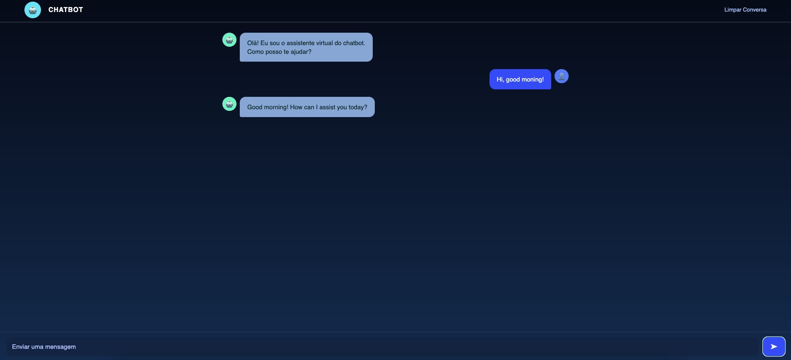

# 🤖 DidBot Chat — Real-Time AI Chatbot

Chatbot em tempo real desenvolvido com **Node.js**, **WebSocket** e **IA da Groq (LLaMA 3)**.
Projeto criado com foco em **arquitetura simples, integração com IA e comunicação em tempo real**, servindo como peça de **portfólio técnico**.

---

## 🎯 Objetivo do Projeto

Demonstrar competências práticas em:

* Comunicação **cliente ↔ servidor** em tempo real
* Integração com **APIs de Inteligência Artificial**
* Organização de projeto backend + frontend
* Uso de **variáveis de ambiente** e boas práticas
* Criação de interface web funcional e responsiva

O projeto pode ser facilmente adaptado para **chatbots corporativos, atendimento automatizado, FAQ inteligente ou produtos digitais**.

---

## 🧠 Como Funciona (Visão Técnica)

1. O frontend estabelece conexão via **WebSocket**
2. O usuário envia uma mensagem
3. O backend recebe e processa a mensagem
4. A mensagem é enviada para a **Groq API**
5. A resposta da IA retorna em tempo real ao cliente

> Não há uso de polling ou requisições HTTP repetidas, garantindo baixa latência.

---

## 🚀 Funcionalidades

* Chat em tempo real com WebSocket
* Integração com modelo **LLaMA 3**
* Interface web responsiva (desktop e mobile)
* Separação clara entre frontend e backend
* Configuração segura via `.env`
* Estrutura pronta para deploy em cloud

---

## 🛠️ Stack Tecnológica

**Backend**

* Node.js
* WebSocket (`ws`)
* Groq SDK
* dotenv

**Frontend**

* HTML5
* CSS3
* JavaScript (Vanilla)

---

## 📂 Estrutura do Projeto

```
didbot-chat/
├── index.html        # Interface do usuário
├── style.css         # Estilização
├── script.js         # Lógica do frontend (WebSocket)
├── server.js         # Servidor WebSocket + IA
├── .env              # Variáveis de ambiente
├── package.json
└── README.md
```

---

## 📸 Preview

Desktop



Mobile


---

## ☁️ Deploy

Compatível com:

* Render
* Railway
* Heroku

Apenas configure a variável de ambiente `GROQ_API_KEY` na plataforma.

---

## 🧩 Melhorias Planejadas

* Persistência de histórico (DB)
* Memória contextual de conversas
* Autenticação de usuários
* Logs estruturados
* Tratamento avançado de erros
* API REST complementar

---

👨‍💻 Desenvolvido por **Diogo David**

Atualmente atuo como **Analista de Logística**, em transição para a área de **Desenvolvimento de Software**, com foco em backend, Java, integração de APIs e aplicações com IA.


---

## 📄 Licença

Licença **MIT** — livre para uso, estudo e adaptação.


⭐ Feedbacks e sugestões são bem-vindos.
